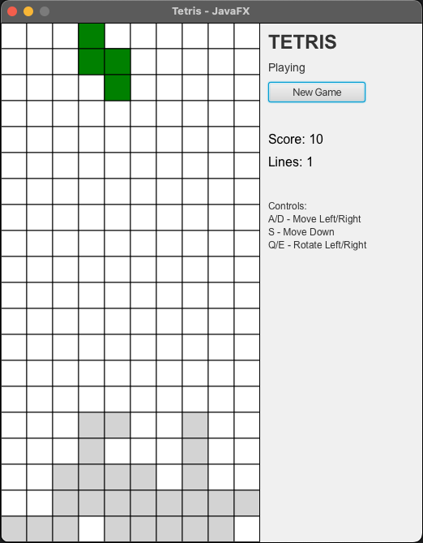
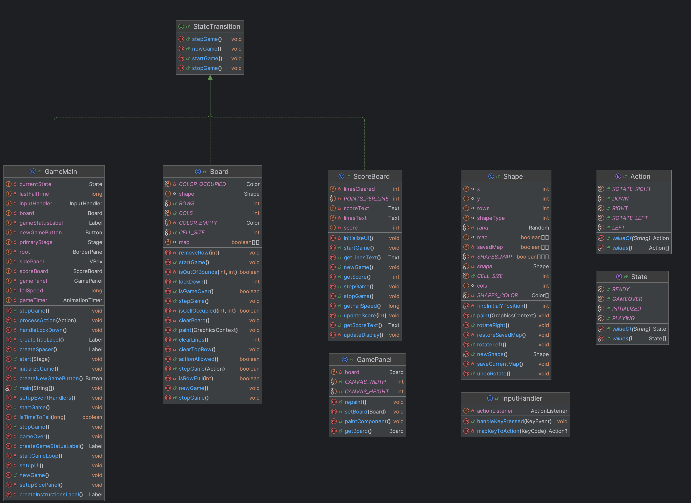

# Tetris Game - JavaFX

A clean implementation of Tetris using JavaFX and SOLID design principles.

<div align="center">
  
</div>

## How to Play

Use the following controls:
- **A/D** or **Left/Right arrows**: Move piece left/right
- **S** or **Down arrow**: Move piece down
- **Q**: Rotate piece counter-clockwise
- **E**: Rotate piece clockwise

Clear horizontal lines to score points:
- 10 points per line cleared

## Build and Run

```bash
# Compile the game
./mvnw clean compile

# Run the game
./mvnw javafx:run
```

## Project Structure

```
src/main/java/tetris/
├── State.java          # Game state enum
├── Action.java         # Player action enum  
├── GameLifecycle.java   # Game lifecycle interface
├── Shape.java          # Tetris pieces
├── Board.java          # Game board logic
├── ScoreBoard.java     # Scoring system
├── InputHandler.java   # Keyboard input handling
├── GamePanel.java      # Game rendering
└── GameMain.java       # Main application
```

## Class Diagram



*Auto-generated from IntelliJ IDEA. Dependencies not shown to keep the diagram simple and focused on class structure.*

## Credits

Developed by Ali
